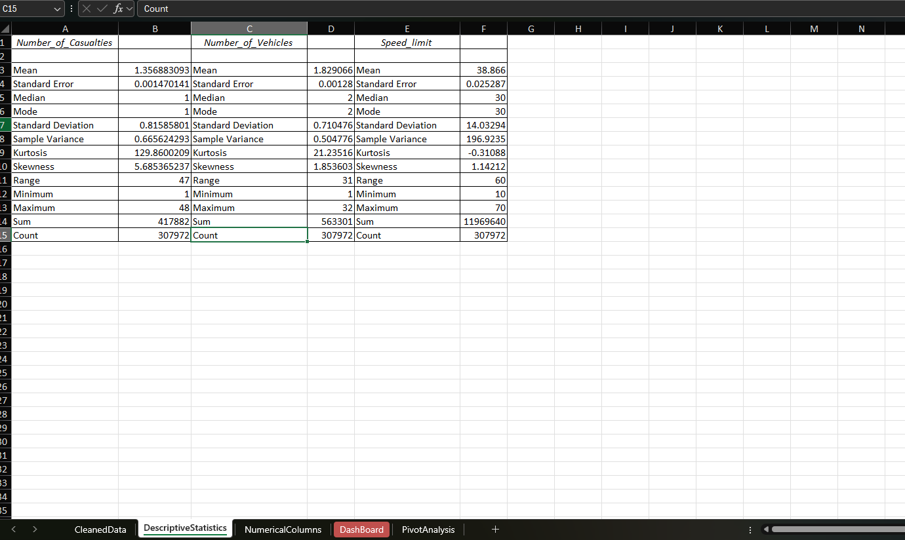
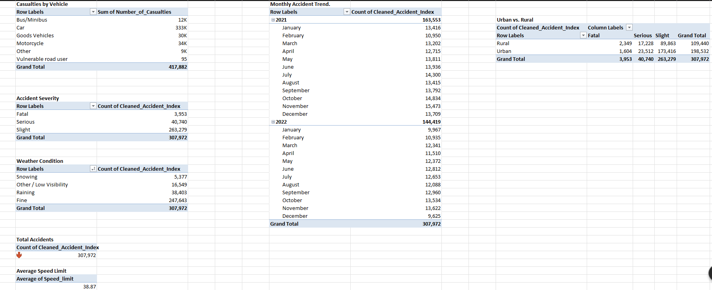
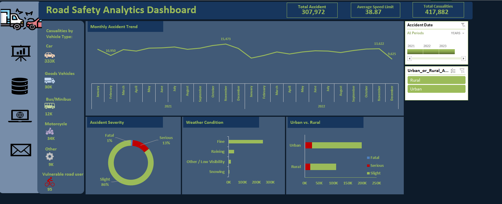

# ROAD SAFETY ANALYTICS

**Transforming 307K+ Traffic Accident Records into Strategic Intelligence for Data-Driven Public Safety Interventions**

---


### **Disclaimer ⚠️**
All datasets, metrics, and reports utilised in this project are anonymised or dummy public domain data designed to demonstrate capabilities in data cleaning, descriptive statistical modelling, and interactive dashboard development in Microsoft Excel for CoreTech Labs.

---

### **INTRODUCTION**
This project aims to support transport authorities and safety planners at CoreTech Labs in identifying high-risk accident hotspots, casualty drivers, and seasonal patterns by evaluating 307,972 accident records (2021–2022). Using descriptive statistical analysis and business intelligence techniques, the project evaluates critical metrics including casualty severity, speed limits, vehicle types, road types, and weather conditions to inform resource allocation and proactive safety policies.

---

### **PROBLEM STATEMENT**
* High volumes of raw road traffic data remain siloed and unstructured, impeding effective safety decision-making.
* Transport planners require clarity on geographic casualty distributions across Urban versus Rural road networks.
* Understanding vehicle-specific risk profiles and casualty severities (Slight, Serious, Fatal) is necessary for targeted policy design.
* Temporal and environmental conditions (such as winter weather and low visibility) create seasonal casualty spikes that require empirical validation.
* Stakeholders need an interactive, dynamic decision-support system to replace static, dense spreadsheets.

---

### **AIM OF PROJECT**
* Standardise and clean 307,972 raw accident records and 417,882 casualty data points for analytical integrity.
* Perform descriptive statistical analysis to calculate central tendencies, variance, and distribution skewness across casualty rates and speed limits.
* Build an interactive executive dashboard featuring dynamic slicers, KPI summary scorecards, and Year-on-Year (YoY) performance trackers.
* Uncover high-risk road characteristics, vehicle contributions, and peak accident months.
* Formulate strategic, data-driven road safety and infrastructure recommendations for CoreTech Labs.

---

### **METHODOLOGY**

* **STEP 1: Data Cleaning & Auditing:**
  * Handle missing entries and standardise categorical fields across vehicle types and road conditions.
  * Standardise date formats and geographic categories.
  * Audit data integrity across 307,972 individual entries.

* **STEP 2: Descriptive Statistical Analysis:**
  * Calculate central tendencies (Mean speed limit: 38.87 mph).
  * Evaluate variance, standard deviation, and casualty distribution skewness (5.68) to assess extreme outlier events.
  * Form data-backed hypotheses regarding environmental and infrastructure influences.

* **STEP 3: Data Modelling & Aggregation:**
  * Construct multidimensional Pivot Tables to evaluate multi-variable interactions.
  * Compute Year-on-Year (YoY) casualty variations and percentage shares by severity.
  * Categorise records by Area (Urban vs Rural), Vehicle Type, and Light/Weather conditions.

* **STEP 4: Interactive Dashboard Architecture:**
  * Design an executive dark-themed interface with high-contrast KPI metric cards.
  * Integrate dynamic timeline and geographic slicers for real-time exploratory slicing.
  * Implement visual conditional formatting and custom icon sets for trend indicators.

* **STEP 5: Reporting & Strategic Synthesis:**
  * Translate visual and statistical findings into actionable safety interventions.






---

### **TOOLS & TECHNOLOGIES**
* **Microsoft Excel:** Data cleaning, formula modelling (`SUMIFS`, `COUNTIFS`, `XLOOKUP`), and statistical calculations.
* **Pivot Tables & Pivot Charts:** Multidimensional data summarisation and dynamic aggregation.
* **Excel Dashboard Architecture:** Interactive Slicers, KPI metric cards, and custom visual formatting.
* **Descriptive Statistics:** Frequency distributions, mean, median, skewness, and variance analysis.

---

### **EXPLORATORY DATA ANALYSIS (EDA) & METRICS BREAKDOWN**

* **High-Level KPIs:**
  * **Total Accidents:** 307,972
  * **Total Casualties:** 417,882
  * **Mean Speed Limit:** 38.87 mph

* **Severity & Distribution:**
  * **Slight Severity:** 86% of total recorded casualties.
  * **Serious Severity:** 13% of incidents.
  * **Fatal Severity:** 1% of total incidents.
  * **Distribution Skewness:** 5.68 (indicating casualty volumes are heavily clustered with rare, extreme severity events).

* **Geographic & Vehicle Patterns:**
  * **Urban vs Rural:** Urban zones account for the highest concentration of total collisions and minor-to-serious injuries.
  * **Vehicle Contribution:** Passenger cars represent the primary contributor, accounting for over 333,000 casualties.
  * **Seasonality & Environment:** Accident occurrences peak distinctly in **November** (15,473 incidents), correlating with reduced daylight and adverse weather conditions.

-----

-----

### **KEY INSIGHTS**
* **Urban Concentration:** High-density urban roads generate the majority of total casualty volume, requiring localised traffic calming measures.
* **Vehicle Disparity:** Cars account for the overwhelming majority of total casualties (333,000), identifying private passenger vehicles as the principal intervention target.
* **Winter Seasonality Risk:** November represents the peak month for accidents (15,473), driven by rain, wet road surfaces, and low visibility.
* **Speed Profile:** An average speed limit of 38.87 mph across incidents confirms that risk is heavily concentrated on suburban arterials and standard urban transit routes rather than high-speed motorways alone.

---

### **RECOMMENDATIONS**
* **Urban Infrastructure Investments:** Prioritise high-density urban corridors with upgraded pedestrian crossings, automated speed enforcement, and improved junction visibility.
* **Targeted Driver Awareness Initiatives:** Deploy driver safety campaigns aimed specifically at passenger car operators focusing on urban speed adherence.
* **Seasonal Emergency & Maintenance Readiness:** Intensify road gritting, maintenance schedules, and emergency response allocation during the October–December window to counter seasonal spikes.
* **Data-Informed Speed Zoning:** Review speed restrictions on suburban routes averaging ~40 mph where collision severity transitions from slight to serious.

---

### **REPOSITORY STRUCTURE**
```text
├── Dashboard/          # Final Excel (.xlsx) Dashboard File
├── Images/             # Screenshots of Dashboard and Charts
├── Reports/            # Final Technical Report (PDF) and Presentation Slides
└── README.md           # Project Documentation
